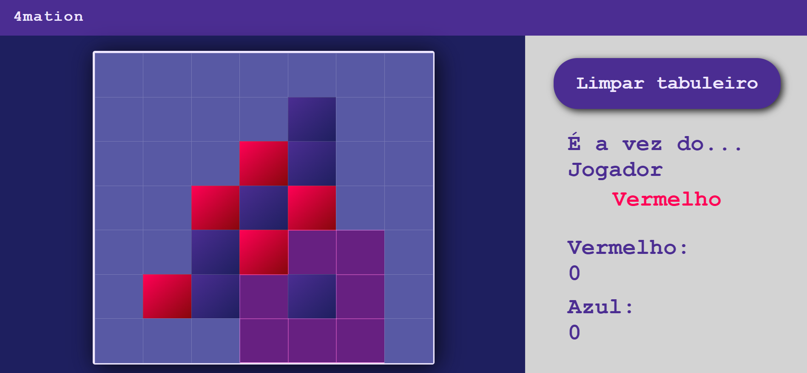

# 4mation 🎮

**4mation** is a board game, developed as part of a college assignment to practice DOM manipulation and interactive features in web development.

> ⚠️ **Note:** the core logic and winning conditions are implemented, but the scoreboard for each player remains on the interface even though it has no logic behind it yet. It’s my first complete attempt at handling **game logic** and **dynamic DOM updates** with JavaScript.

## 📸 Preview

---

## 📌 Rules of the game
- 4mation is played on a **7×7 board**.
- Two players take turns:
  - Player 1 places **blue pieces**.
  - Player 2 places **red pieces**.
- The first move can be in **any empty cell**.
- After that, each move must be placed in an **empty cell adjacent** (orthogonally or diagonally) to the opponent’s last move.
- If no adjacent cells are available, the player can place their piece **anywhere**.
- Players alternate turns until:
  - **One player forms a sequence of four pieces** (horizontally, vertically, or diagonally) → that player wins.
  - Or all cells are filled with no winner → the game ends in a draw.

---

## ✨ Features implemented
✅ **7×7 empty board** with a message area indicating the current player.  
✅ **Valid move checks:** no pieces can be placed in occupied cells.  
✅ **Highlighting valid cells:** cells where the current player can move are visually indicated.  
✅ **Turn management:** the message updates after every valid move.  
✅ **Winning & draw detection:** game announces the winner or a draw.  

---

## 🚀 Technologies
- **HTML** for structure  
- **CSS** for styling and highlighting cells  
- **JavaScript** for game logic and DOM manipulation

---

## ▶️ How to run
1. Clone this repository.
2. Open `index.html` in your browser.
3. Enjoy playing!

---

👩‍💻 *Developed by Eduarda Rocha*
